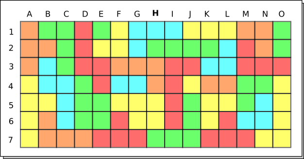
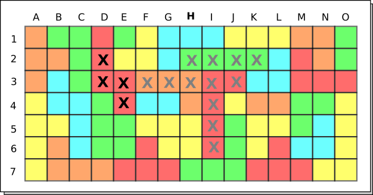
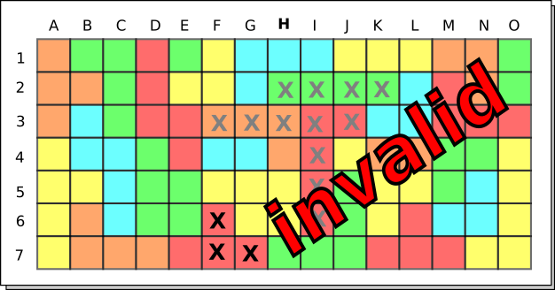
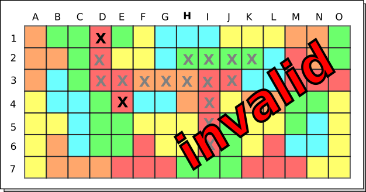

# GSE-Nochmal-Android

Projekt für Grundlagen-Software-Engineering 2021.

Realisierung des Brettspiels [Nochmal!](https://de.wikipedia.org/wiki/Noch_mal!) (c) in Java im Rahmen des Moduls GSE.

## Spielanleitung: Encore

Encore wird mit einem oder mehreren Spielern gespielt. Jeder Spieler spielt auf seinem eigenen Spielfeld. Auf dem Spielfeld kann der Spieler Felder ankreuzen. Ziel des Spiels ist, seine Kreuze strategisch klug zu setzen und so möglichst viele Punkte zu erzielen.

Ein mögliches Spielfeld kann so aussehen:

Zunächst würfelt ein Spieler jeweils drei Zahlen- und drei Farbwürfel. Jeder Spieler kann sich jetzt einen Zahlen- und einen Farbwürfel aussuchen (Würfel dürfen auch von mehreren Spielern gewählt werden). Der Zahlenwürfel bestimmt, wie viele Felder er ankreuzen darf, der Farbwürfel, welche Farbe er ankreuzen darf. Jetzt macht jeder Spieler seinen Zug.

### Ankreuz-Regeln:

Es müssen genauso viele Kreuze gemacht werden, wie der gewählte Zahlenwürfel anzeigt. Kreuze dürfen nur auf Feldern der Farbe gemacht werden, die der Farbwürfel anzeigt.

Das erste Kreuz eines Zuges muss entweder auf der mittleren Spalte (H-Spalte) liegen, oder an ein anderes Kreuz angrenzen, das in einem vorherigen Zug gesetzt wurde. Die weiteren Kreuze des Zuges müssen an das erste Kreuz des aktuellen Zuges angrenzen. Anders formuliert: Pro Zug muss eine zusammenhängende Fläche angekreuzt werden.

### Beispiel eines validen Zuges:

(graue Kreuze sind aus vorherigen Zügen)

### Beispiele eines invaliden Zuges:

(Der neue Zug grenzt nicht an bisher gemachte Kreuze an)

(Der Zug hängt in sich nicht zusammen)

Eine präzisere Formulierung der Zugregeln findet Ihr in den User Stories.

## Spielende:

Das Spiel endet, sobald ein Spieler mindestens zwei Farben auf seinem Spielfeld vollstaendig angekreuzt hat. Die anderen Spieler koennen ihren Zug noch beenden. Dann werden die Punkte gezaehlt (s.u.), und es gewinnt der Spieler mit den meisten Punkten.

## Bepunktung:

Ein Spieler erhält Punkte für jede Spalte, die er vollständig angekreuzt hat. Dabei gibt es mehr Punkte, je weiter außen die Spalten liegen. (Die Spalten weiter außen sind ja auch schwieriger zu erreichen). Zusaetzlich gibt es Punkte, wenn ein Spieler eine Farbe vollstaendig angekreuzt hat.
